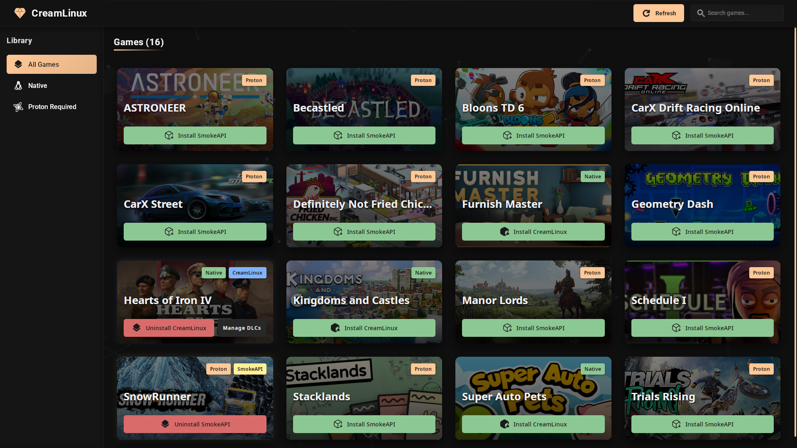

# CreamLinux

CreamLinux is a GUI application for Linux that simplifies the management of DLC in Steam games. It provides a user-friendly interface to install and configure CreamAPI (for native Linux games) and SmokeAPI (for Windows games running through Proton).



## Features

- **Auto-discovery**: Automatically finds Steam games installed on your system
- **Native support**: Installs CreamLinux for native Linux games
- **Proton support**: Installs SmokeAPI for Windows games running through Proton
- **DLC management**: Easily select which DLCs to enable
- **Modern UI**: Clean, responsive interface that's easy to use

## Installation

### AppImage (Recommended)

1. Download the latest `CreamLinux.AppImage` from the [Releases](https://github.com/novattz/creamlinux/releases) page
2. Make it executable:
   ```bash
   chmod +x CreamLinux.AppImage
   ```
3. Run it:
   ```bash
   ./CreamLinux.AppImage
   ```

### Building from Source

#### Prerequisites

- Rust 1.77.2 or later
- Node.js 18 or later
- npm or yarn

#### Steps

1. Clone the repository:

   ```bash
   git clone https://github.com/novattz/creamlinux.git
   cd creamlinux
   ```

2. Install dependencies:

   ```bash
   npm install # or yarn
   ```

3. Build the application:

   ```bash
   NO_STRIP=true npm run tauri build
   ```

4. The compiled binary will be available in `src-tauri/target/release/creamlinux`

### Desktop Integration

If you're using the AppImage version, you can integrate it into your desktop environment:

1. Create a desktop entry file:

   ```bash
   mkdir -p ~/.local/share/applications
   ```

2. Create `~/.local/share/applications/creamlinux.desktop` with the following content (adjust the path to your AppImage):

   ```
   [Desktop Entry]
   Name=Creamlinux
   Exec=/absolute/path/to/CreamLinux.AppImage
   Icon=/absolute/path/to/creamlinux-icon.png
   Type=Application
   Categories=Game;Utility;
   Comment=DLC Manager for Steam games on Linux
   ```

3. Update your desktop database so creamlinux appears in your app launcher:

```bash
update-desktop-database ~/.local/share/applications
```

## Troubleshooting

### Common Issues

- **Game doesn't load**: Make sure the launch options are correctly set in Steam
- **DLCs not showing up**: Try refreshing the game list and reinstalling
- **Cannot find Steam**: Ensure Steam is installed and you've launched it at least once

### Debug Logs

Logs are stored at: `~/.cache/creamlinux/creamlinux.log`

## Contributing

Contributions are welcome! Please feel free to submit a Pull Request.

### Development Setup

1. Clone this repository
2. Install dependencies:
   ```bash
   npm install
   ```
3. Start the development server:
   ```bash
   npm run tauri dev
   ```

## License

This project is licensed under the MIT License - see the [LICENSE](LICENSE.md) file for details.

## Credits

- [Creamlinux](https://github.com/anticitizn/creamlinux) - Native DLC support
- [SmokeAPI](https://github.com/acidicoala/SmokeAPI) - Proton support
- [Tauri](https://tauri.app/) - Framework for building the desktop application
- [React](https://reactjs.org/) - UI library
