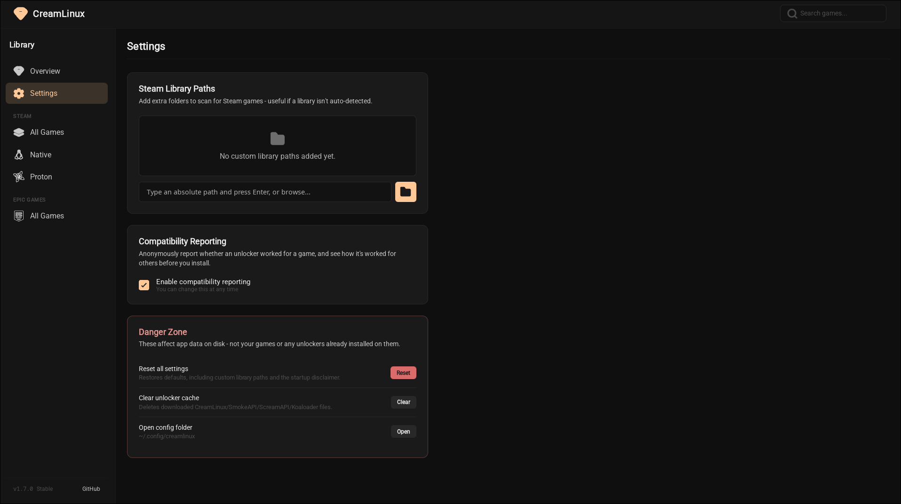

# CreamLinux

CreamLinux is a GUI application for Linux that simplifies the management of DLC IDs in Steam games. It provides a user-friendly interface to install and configure CreamAPI (for native Linux games), SmokeAPI (for Windows games running through Proton) and ScreamAPI (Epic Games).

## Watch the demo here:

[](https://www.youtube.com/watch?v=neUDotrqnDM)

## Features

- **Auto-discovery**: Automatically finds Steam games installed on your system
- **Native support**: Installs CreamLinux for native Linux games
- **Proton support**: Installs SmokeAPI for Windows games running through Proton
- **Epic Games support**: Installs ScreamAPI for games running through Heroic/Legendary
- **DLC management**: Easily select which DLCs to enable
- **Modern UI**: Clean, responsive interface that's easy to use

## Installation

### AppImage (Recommended)

1. Download the latest `creamlinux.AppImage` from the [Releases](https://github.com/Novattz/creamlinux-installer/releases) page
2. Make it executable:
   ```bash
   chmod +x creamlinux.AppImage
   ```
3. Run it:

   ```bash
   ./creamlinux.AppImage
   ```

   For Nvidia users use this command:

   ```
   WEBKIT_DISABLE_DMABUF_RENDERER=1 ./creamlinux.AppImage
   ```

### Nix
You can add this package to your configuration using `pkgs.fetchFromGitHub`:
```nix
let
  creamlinux = import (pkgs.fetchFromGitHub {
    owner = "Novattz";
    repo = "creamlinux-installer";
    rev = "main"; # replace with a commit hash to pin the version
    hash = ""; # paste the value returned by the error your rebuild will output
  }) { inherit pkgs; };
in
{
  environment.systemPackages = [ creamlinux ];
}
```
or, using `builtins.fetchTarball`:
```nix
let
  creamlinux = import (builtins.fetchTarball {
    url = "https://github.com/Novattz/creamlinux-installer/archive/main.tar.gz";
    sha256 = ""; # See above
  }) { inherit pkgs; };
in
{
  environment.systemPackages = [ creamlinux ];
}
```
alternatively and if you want to pin the package version, using [npins](https://github.com/andir/npins):
```bash
npins add github Novattz creamlinux-installer --branch main
```
```nix
let
  sources = import ./npins;
in
{
  environment.systemPackages = [
    (import sources.creamlinux-installer { inherit pkgs; })
  ];
}
```
Those are the recommended methods to add creamlinux-installer to your environment. However, you could also add it as an input of your flake, like so:
```nix
{
  inputs = {
    nixpkgs.url = "github:NixOS/nixpkgs/nixos-unstable";
    creamlinux-installer = {
      type = "github";
      owner = "Novattz";
      repo = "creamlinux-installer";
      flake = false;
    };
  };
}
```
Then, in your configuration:
```nix
environment.systemPackages = [
  (import inputs.creamlinux-installer { inherit pkgs; })
];
```
Similarly to running the AppImage, you will need to set `WEBKIT_DISABLE_DMABUF_RENDERER=1` if your GPU is from Nvidia in order to run the package.

### Building from Source

#### Prerequisites

- Rust 1.77.2 or later
- Node.js 18 or later
- webkit2gtk-4.1 (libwebkit2gtk-4.1 for debian)
- npm or yarn

#### Steps

1. Clone the repository:

   ```bash
   git clone https://github.com/Novattz/creamlinux-installer.git
   cd creamlinux-installer
   ```

2. Install dependencies:

   ```bash
   npm install # or yarn
   ```

3. Build the application:

   ```bash
   NO_STRIP=true npm run tauri build
   ```

4. The compiled binary will be available in `src-tauri/target/release/creamlinux`

### Desktop Integration

If you're using the AppImage version, you can integrate it into your desktop environment:

1. Create a desktop entry file:

   ```bash
   mkdir -p ~/.local/share/applications
   ```

2. Create `~/.local/share/applications/creamlinux.desktop` with the following content (adjust the path to your AppImage):

   ```
   [Desktop Entry]
   Name=Creamlinux
   Exec=/absolute/path/to/CreamLinux.AppImage
   Icon=/absolute/path/to/creamlinux-icon.png
   Type=Application
   Categories=Game;Utility;
   Comment=DLC Manager for Steam games on Linux
   ```

3. Update your desktop database so creamlinux appears in your app launcher:

```bash
update-desktop-database ~/.local/share/applications
```

## Troubleshooting

### Common Issues

- **Game doesn't load**: Make sure the launch options are correctly set in Steam
- **DLCs not showing up**: Try refreshing the game list and reinstalling
- **Cannot find Steam**: Ensure Steam is installed and you've launched it at least once

### Debug Logs

Logs are stored at: `~/.cache/creamlinux/creamlinux.log`

Found a bug? Please report it on the [GitHub Issues page](https://github.com/Novattz/creamlinux-installer/issues).

## License

This project is licensed under the MIT License - see the [LICENSE](LICENSE.md) file for details.

## Credits

- [Creamlinux](https://github.com/anticitizn/creamlinux) - Native support
- [SmokeAPI](https://github.com/acidicoala/SmokeAPI) - Proton support
- [Tauri](https://tauri.app/) - Framework for building the desktop application
- [React](https://reactjs.org/) - UI library
